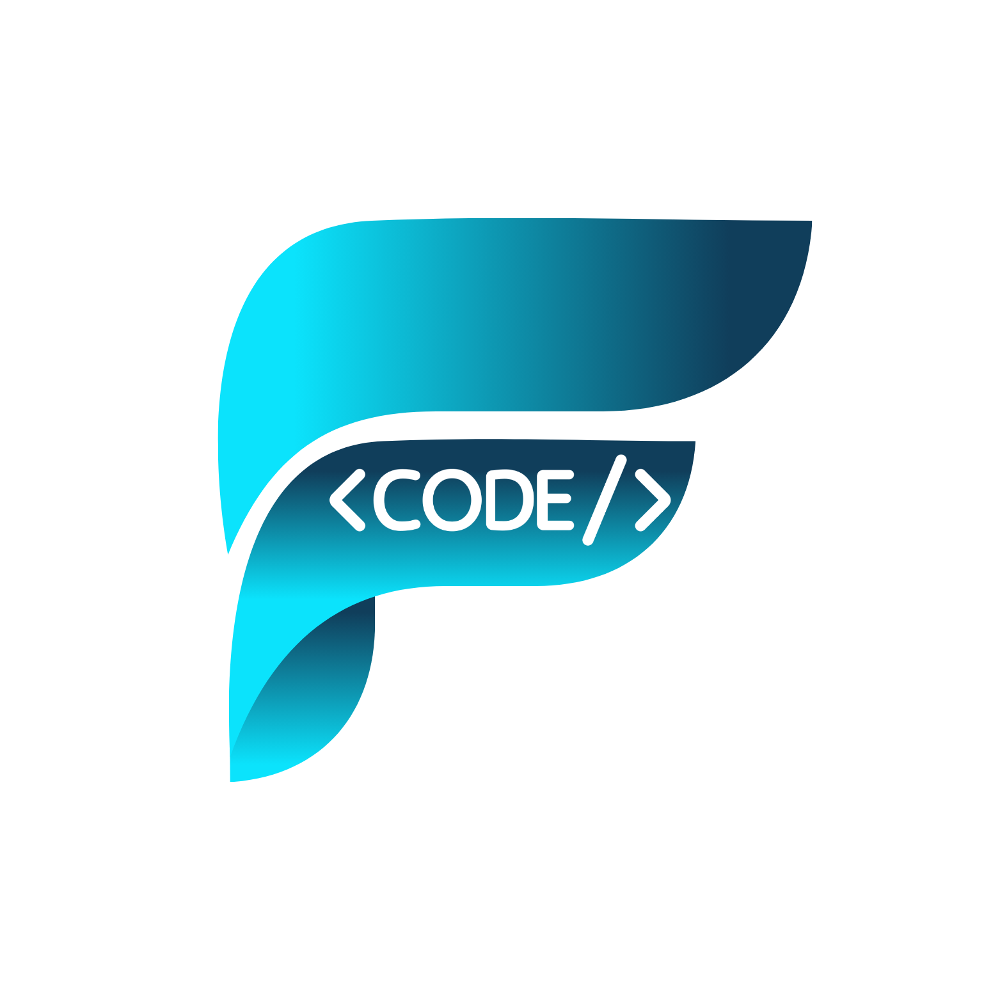

# Future Code Technology
### The Future is Written in Code

---

🚀 A technical team specializing in building modern and innovative software solutions.  
We design, develop, and deploy applications that empower the future of technology.

مستقبل التقنية يُكتب بالكود — نصنع حلولًا برمجية ترتقي بالمجتمع الرقمي.

---

### 💡 What We Do
- Full-Stack Web Development
- Mobile App Development
- Software Engineering
- Problem Solving & Algorithms
  
---

### 🛠 Tech Stack

| Category | Technologies |
|---------|--------------|
| Languages | Python, C#, C++, JavaScript |
| Web | HTML, CSS, JS |
| Mobile | Flutter |
| Tools & Platforms | GitHub, Linux, VS Code, Visual Studio, |
| Interests | AI, Cloud, Embedded Systems |

---

### 📂 Our Project Types
We organize code in clear categories to ensure scalability:

- `apps-web/` → Web Applications  
- `apps-mobile/` → Mobile & Flutter Projects  
- `ai-ml/` → Artificial Intelligence Experiments  
- `systems/` → Desktop / Low-Level Projects  
- `training/` → Problem-Solving & Learning Repositories  

---

### 🤝 Contributions
We welcome collaboration from developers who share our passion for innovation.  
Check our contributing guide before submitting PRs.

---

### 📬 Contact & Social
- Email: futurecode77@gmail.com
- Instagram: @fcode_7  https://www.instagram.com/fcode_7?igsh=MWZneGZraDdkODJ4bw==
- LinkedIn: Future Code Technology (soon)

---

© 2025 Future Code Technology — All Rights Reserved

